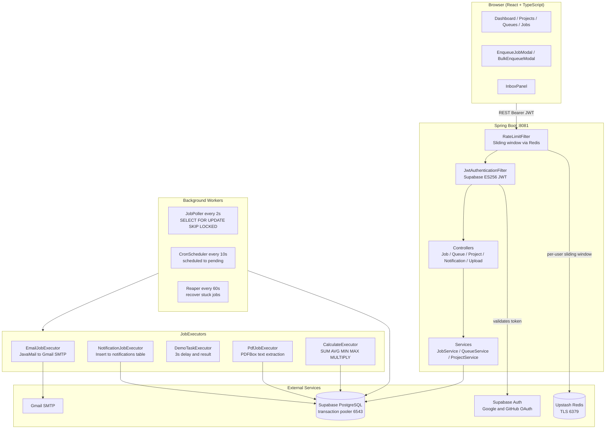
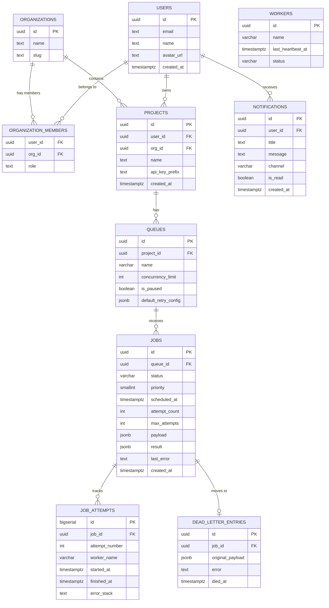
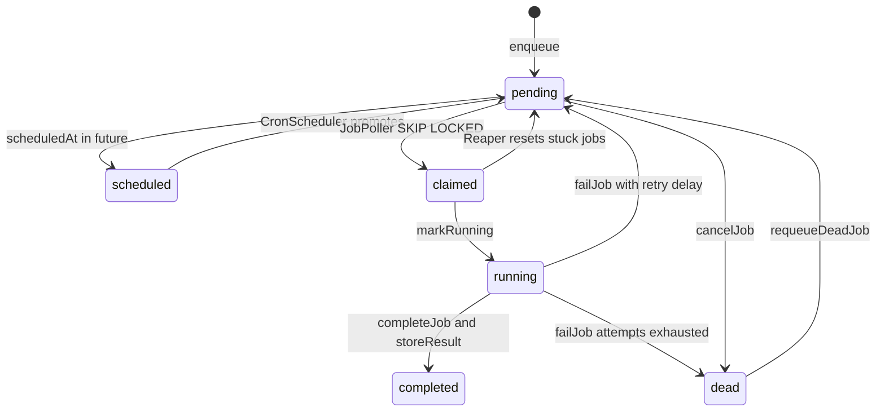

# JobScheduler

🚀 **Live Application**: [https://job-scheduler-app-three.vercel.app/](https://job-scheduler-app-three.vercel.app/)

A full-stack distributed job queue manager built with Spring Boot and React. Create projects, define queues, enqueue jobs with custom payloads, and let background workers process them with retries, dead-letter handling, rate limiting, and a real-time dashboard.

---

## What is this?

JobScheduler is a self-contained job queue platform. You enqueue a job with a JSON payload onto a named queue, and a worker picks it up, executes the right logic, stores the result, and updates the job status in real time.

Think of it as a lightweight in-house alternative to BullMQ or Celery, with a full management UI.

---

## Features

- **Projects and Queues** - organise jobs into projects, define named queues with concurrency limits and retry policies
- **Job lifecycle** - `pending -> claimed -> running -> completed / failed -> dead`
- **Smart retries** - exponential, linear, or fixed back-off; per-job or per-queue config
- **Dead-letter queue** - exhausted jobs are preserved with their payload and error
- **5 built-in executors** - Email, Notification (inbox), Demo-Task, PDF Extractor, Calculator
- **Result storage** - each executor stores structured output on the job record
- **Bulk enqueue** - paste a JSON array and create up to 500 jobs in one request
- **Notification inbox** - in-app messages delivered to users, shown as a slide-in inbox panel with unread badge
- **PDF upload and extract** - upload a PDF from the browser; Apache PDFBox extracts text server-side
- **Rate limiting** - sliding-window per-user rate limiting via Upstash Redis
- **Flexible execution scheduling** - enqueue jobs for immediate execution, delayed (in seconds), or recurring on a custom Cron schedule
- **AI failure summaries** - automated diagnostic error pattern analysis with root-cause identification and suggested fix steps for failed jobs
- **Real-time dashboard** - live job status breakdown, worker heartbeats, progress bar
- **OAuth login** - Google and GitHub sign-in via Supabase Auth

---

## Tech Stack

| Layer | Technology |
|---|---|
| Backend | Java 21, Spring Boot 3.3.2 |
| ORM | Spring Data JPA, Hibernate 6, HikariCP |
| Database | PostgreSQL (Supabase cloud, transaction pooler) |
| Auth | Supabase Auth (OAuth), JWT ES256/ECDSA P-256 |
| Rate limiting | Redis (Upstash), Lettuce TLS client |
| PDF extraction | Apache PDFBox 3.0.3 |
| Email | Spring Boot Mail / Gmail SMTP |
| Frontend | React 18, TypeScript, Vite |
| Routing | React Router v6 |
| HTTP client | Axios |
| Auth client | Supabase JS SDK |
| Build tools | Maven (backend), npm (frontend) |
| Version control | Git, GitHub |
| Deployment | Render (backend), Vercel (frontend) |

---

## Architecture Diagram



---

## ER Diagram



---

## Job Lifecycle



---

## API Documentation

All endpoints require `Authorization: Bearer <supabase-jwt>` unless marked public.
Base URL: `http://localhost:8081`

### Projects

**`GET /api/projects`** - List all projects for the authenticated user.

**`POST /api/projects`** - Create a project. Body: `{ "name": "My App" }` Response: `201`

**`PUT /api/projects/{id}`** - Rename. Body: `{ "name": "New Name" }` Response: `200`

**`DELETE /api/projects/{id}`** - Delete project and all its queues/jobs. Response: `204`

---

### Queues

**`GET /api/projects/{projectId}/queues`** - List queues. Response: `200`

**`POST /api/projects/{projectId}/queues`** - Create queue.
```json
{ "name": "email", "concurrencyLimit": 5, "defaultRetryConfig": { "strategy": "exponential", "base_delay_seconds": 1, "max_attempts": 3 } }
```

**`PATCH /api/projects/{projectId}/queues/{queueId}`** - Update concurrency/pause/retry (all fields optional).

**`POST /api/projects/{projectId}/queues/{queueId}/pause`** - Pause. Response: `204`

**`POST /api/projects/{projectId}/queues/{queueId}/resume`** - Resume. Response: `204`

**`DELETE /api/projects/{projectId}/queues/{queueId}`** - Delete. Response: `204`

---

### Jobs

**`POST /api/queues/{queueId}/jobs`** - Enqueue a job (Immediate, Delayed, or Recurring via Cron).
```json
{
  "payload": { "operation": "SUM", "values": [10, 20, 30] },
  "priority": 0,
  "scheduledAt": "2026-08-24T00:00:00Z",
  "cronExpression": "0 0 * * * *",
  "maxAttempts": 3
}
```
Response: `201` - full job object with `id`, `status`, `payload`, `result`, etc.

**`POST /api/queues/{queueId}/jobs/bulk`** - Enqueue up to 500 jobs in one transaction.
```json
{
  "payloads": [
    { "operation": "SUM", "values": [1, 2, 3] },
    { "operation": "MAX", "values": [9, 5, 7] }
  ],
  "priority": 0,
  "maxAttempts": 3
}
```
Response: `201` - `{ "enqueued": 2, "queueId": "uuid", "jobIds": ["uuid1", "uuid2"] }`

**`GET /api/queues/{queueId}/jobs`** - List jobs. Query: `status`, `page`, `size`. Response: `200` paginated.

**`GET /api/jobs`** - All jobs for current user (cross-queue). Response: `200` paginated.

**`GET /api/jobs/{jobId}`** - Single job. Response: `200`

**`GET /api/jobs/{jobId}/attempts`** - Execution attempts newest first.
```json
[{ "id": 1, "attemptNumber": 0, "workerName": "spring-boot-instance-1", "startedAt": "...", "finishedAt": "...", "errorStack": null }]
```

**`POST /api/jobs/{jobId}/ai-summary`** - Generate or retrieve AI diagnostic summary for a failed job. Response: `{ "summary": "..." }`

**`POST /api/jobs/{jobId}/cancel`** - Cancel `pending`/`scheduled` job. Error `409` if running.

**`POST /api/jobs/{jobId}/requeue`** - Re-enqueue `dead`/`failed` job. Resets attempt count.

---

### Notifications

**`GET /api/notifications`** - List notifications newest first.
```json
[{ "id": "uuid", "title": "Job Scheduler Notification", "message": "Done", "channel": "in-app", "isRead": false, "createdAt": "..." }]
```

**`GET /api/notifications/unread-count`** - `{ "count": 3 }`

**`POST /api/notifications/mark-all-read`** - Response: `204`

**`POST /api/notifications/{id}/mark-read`** - Response: `204`

---

### File Upload

**`POST /api/upload/pdf`** - Upload PDF. Body: `multipart/form-data` field `file`.
Response: `{ "fileName": "resume.pdf", "fileUrl": "http://localhost:8081/api/upload/files/uuid_resume.pdf", "sizeBytes": "45678" }`

**`GET /api/upload/files/{fileName}`** *(public - no auth)* - Serves uploaded file for PdfJobExecutor.

---

### Dashboard

**`GET /api/dashboard`** - Summary for current user.
```json
{
  "jobCountsByStatus": { "pending": 5, "running": 2, "completed": 100 },
  "totalJobs": 111, "totalQueues": 5, "totalProjects": 2,
  "workers": [{ "name": "spring-boot-instance-1", "status": "active", "lastHeartbeatAt": "..." }]
}
```

---

### Error responses

All errors follow RFC 9457 Problem Detail:
```json
{ "status": 404, "title": "Not Found", "detail": "Job not found: uuid" }
```

| Status | When |
|---|---|
| `400` | Invalid argument |
| `401` | Missing or invalid JWT |
| `404` | Resource not found |
| `409` | Illegal state (cancel a running job) |
| `422` | Validation failure - includes `errors` map |
| `429` | Rate limit exceeded - includes `Retry-After` header |
| `500` | Unexpected server error |

### Rate limit headers on every response

| Header | Description |
|---|---|
| `X-RateLimit-Limit` | Max requests in the window |
| `X-RateLimit-Remaining` | Requests left |
| `X-RateLimit-Reset` | Unix epoch when window resets |
| `Retry-After` | Seconds to wait (only on 429) |

---

## Design Decisions

### 1. Supabase for auth and database
- Zero infrastructure to manage; JWT verification is pure in-memory crypto (JWKS + ES256)
- Connection pooler (port 6543) requires `prepareThreshold=0` to disable server-side prepared statements, adding slight per-query overhead
- Vendor lock-in for auth; migrating to self-hosted would require replacing JwtService
- **Alternative rejected:** Self-hosted Postgres + Keycloak - too much infrastructure overhead for a first version

### 2. SELECT FOR UPDATE SKIP LOCKED for job claiming
- No separate locking table or distributed lock needed; multiple workers claim concurrently without conflicts
- PostgreSQL-specific - would need rewriting for MySQL/SQLite
- **Alternative rejected:** Redis Redlock - adds a network round-trip per claim; Postgres row-locking is sufficient and keeps the system simpler

### 3. Sliding-window rate limiting via Redis sorted set
- True sliding window with no burst at window boundaries (unlike fixed-window counters)
- Atomic Lua script: prune + count + insert in one Redis call, no race conditions
- Slightly more Redis overhead than INCR counter (3 operations per request)
- **Alternative rejected:** Token bucket (INCR + TTL) - allows bursts at window boundaries

### 4. Result stored as JSONB on the jobs table
- Single query to fetch job + result with no join; flexible schema per executor
- Job row size grows for large results; PDFs store only a 500-char summary to mitigate this
- **Alternative rejected:** Separate job_results table - adds join complexity for a simple 1:1 relationship

### 5. Executor routing by queue name
- Decouples routing from payload structure; natural isolation with one executor per queue
- Queue name must match `queueName()` exactly (case-insensitive); renaming a queue breaks routing
- **Alternative rejected:** Routing by payload `type` field - requires every payload to carry a type; creates silent fallthrough on missing field

### 6. Stateless JWT authentication
- Horizontally scalable; public keys cached at startup - validation is pure in-memory crypto
- Revoked tokens remain valid until expiry (Supabase default: 1 hour)
- **Alternative rejected:** Server-side sessions - requires shared session storage across instances

### 7. Per-queue Semaphore for concurrency control
- Enforces concurrencyLimit precisely per worker instance; lock-free for the common case
- Per-instance only - two worker instances with limit 5 could run 10 concurrent jobs from the same queue
- **Alternative rejected:** Distributed Redis semaphore - adds complexity; per-instance limits acceptable for now

### 8. Manual schema management (ddl-auto=validate)
- Full control over indexes, constraints, and column types; fails fast if code and DB are out of sync
- No Flyway/Liquibase - migrations applied ad-hoc with no audit trail of schema changes
- **Alternative rejected:** Hibernate auto DDL - produces suboptimal SQL and is dangerous in production

---

## Prerequisites

- **Java 21+** - [download](https://adoptium.net)
- **Maven 3.9+** - [download](https://maven.apache.org/download.cgi)
- **Node.js 18+** and npm - [download](https://nodejs.org)
- **Supabase account** - [supabase.com](https://supabase.com) (free tier works)
- **Upstash account** - [upstash.com](https://upstash.com) (free Redis tier works)
- **Gmail account** - for the Email executor (any Gmail with an App Password)

---

## Setup

### 1. Clone

```bash
git clone https://github.com/your-username/Job-Scheduler.git
cd Job-Scheduler
```

### 2. Set up Supabase

1. Create a new project at [supabase.com](https://supabase.com)
2. In the SQL Editor, run the entire contents of `database/schema.sql`
3. In Settings > API, copy your Project URL and anon key
4. In Authentication > Providers, enable Google and/or GitHub OAuth

### 3. Configure the backend

Edit `backend/src/main/resources/application.properties` and replace placeholder values for `spring.datasource.url`, `supabase.jwks.url`, `upstash.redis.*`, and `spring.mail.*`.

### 4. Configure the frontend

```bash
cd frontend
cp .env.example .env
# Fill in VITE_SUPABASE_URL and VITE_SUPABASE_ANON_KEY
```

### 5. Run the backend

```bash
cd backend
mvn spring-boot:run
# Starts on http://localhost:8081
# Confirm: JobPoller registered 5 executor(s): [email, notification, demo-task, pdf-extract, calculate]
```

### 6. Run the frontend

```bash
cd frontend
npm install
npm run dev
# Starts on http://localhost:5173
```

---

## Rate limits

| Bucket | Limit | Window |
|---|---|---|
| Default (all endpoints) | 100 requests | 60 seconds |
| Enqueue (`POST /api/queues/*/jobs`) | 20 requests | 60 seconds |

---

## Testing

Automated tests for critical functionality are located in `backend/src/test/java/com/jobscheduler/`.

### Automated Test Coverage
- **Controllers:** `JobControllerTest`, `DashboardControllerTest` (API mapping, validation, response format)
- **Background Workers:** `JobPollerTest`, `CronSchedulerTest` (Polling queue semantics, state transitions)

### Running Automated Tests
```bash
cd backend
mvn test
```

---

## Evaluation Criteria & Project Fulfillment

Below is a breakdown of how each evaluation criterion was satisfied in this project:

| Criteria | Implementation Summary | Key Location / Code References |
|---|---|---|
| **System Architecture** | Multi-tier distributed system comprising React frontend, Spring Boot API, worker threads, PostgreSQL job queue, Redis sliding window rate limiter, and Supabase JWKS auth. | [`README.md (Architecture Diagram)`](#architecture-diagram), `CronScheduler.java`, `JobPoller.java` |
| **Database Design** | Relational schema in PostgreSQL with JSONB columns for payloads/results/retry configs. Includes indexed poller queries (`idx_jobs_poller`), unique project/queue constraints, and dead-letter tables. | [`database/schema.sql`](database/schema.sql), [`README.md (ER Diagram)`](#er-diagram) |
| **Backend Engineering** | Built on Java 21 & Spring Boot 3.3.2. Features 5 dynamic job executors (`Email`, `Notification`, `PdfExtract`, `Calculate`, `DemoTask`), clean Service-Repository patterns, and custom JWT authentication filter. | `backend/src/main/java/com/jobscheduler/` |
| **Reliability & Concurrency** | Atomic job claiming using `SELECT FOR UPDATE SKIP LOCKED` to prevent double-processing. Per-queue Semaphore concurrency caps, automated Reaper thread for stuck job recovery, and exponential retry backoff. | `JobRepository.java`, `JobPoller.java`, `Reaper.java` |
| **Frontend & UX** | Modern React 18 + TypeScript + Vite SPA with live polling dashboard, interactive job status grid, inbox notification panel, JSON payload auto-formatting modal, and bulk enqueue modal. | `frontend/src/` |
| **API Design** | Clean RESTful conventions across 32 endpoints with standard HTTP status codes, structured RFC 9457 error responses, pagination, and `X-RateLimit-*` headers. | [`README.md (API Documentation)`](#api-documentation), `controller/` |
| **Documentation** | Comprehensive documentation including Architecture Diagrams, ER Diagrams, State Diagrams, setup guide, design trade-offs matrix, and API references. | [`README.md`](README.md), [`context.txt`](context.txt) |
| **Testing** | Automated unit and integration test suite using JUnit 5, Spring Boot Test, and Mockito for controllers and background worker schedulers. | `backend/src/test/java/com/jobscheduler/` |

---

## Known limitations

- PDF upload stores files in OS temp dir - use S3/GCS in production
- Notification push and sms channels are simulated - replace with FCM/Twilio
- No Docker setup yet

---

## License

MIT

